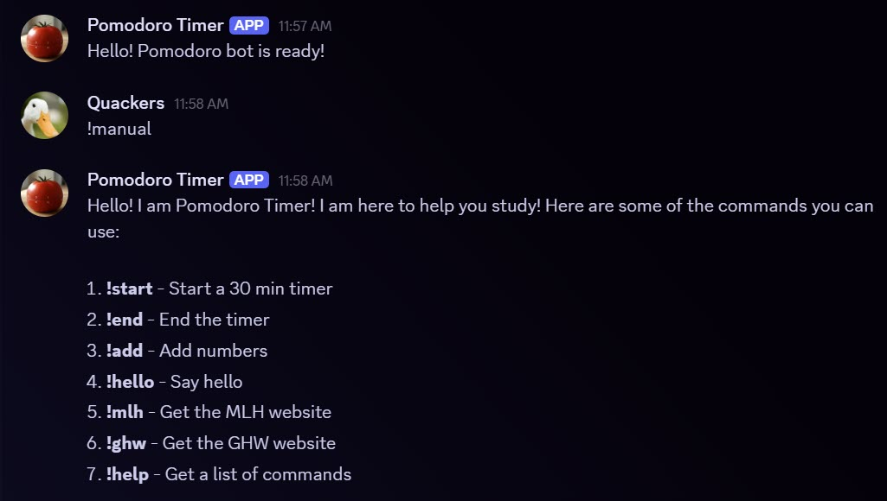

# Pomodoro_Bot
A Discord ChatBot made with Python


### The Pixegami Tutorial
- [YouTube: How to Make a Discord Bot with Python](https://youtu.be/2k9x0s3awss)
### Official Doc
- [Discord.py Documentation ](https://discordpy.readthedocs.io/en/stable/quickstart.html)
### Developer Mode
- [Discord Developer Applications](https://discord.com/developers/applications)

- This project hides codes using environment variables. In order to make it work for you, create a file with the name `.env` and place the two variables that you get from Discord Developer Applications: 
```
BOT_TOKEN="token string goes here"
CHANNEL_ID=Integer ID goes here
```
